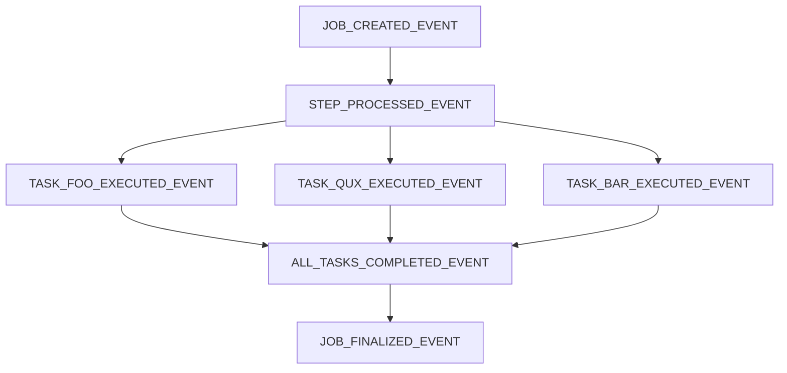
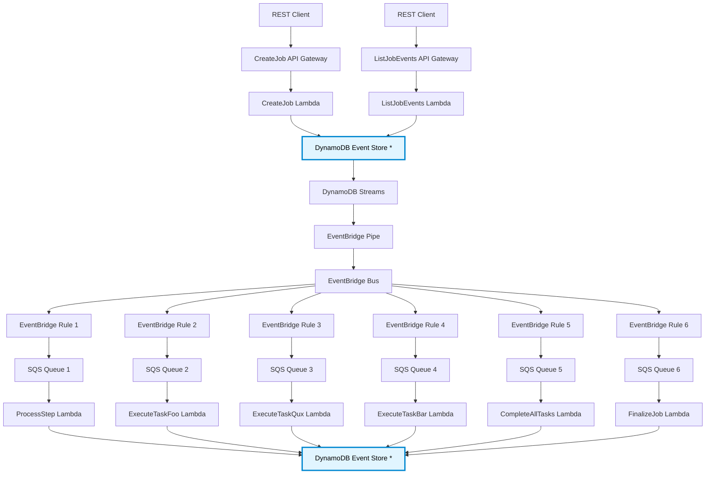

# Template DynamoDB EventBridge Driven

A TypeScript template for building event-driven applications on AWS using DynamoDB as an event store, EventBridge for event routing, and SQS with Lambda for asynchronous processing.

---

## What is This?

This template implements an event-driven architecture using AWS serverless services. It uses an Event Sourcing pattern where application state changes are stored as a sequence of immutable events in DynamoDB, then piped using EventBridge and then handled by an SQS-Lambda combo worker.

I use it in some projects like:

- [Small Event-Driven E-Commerce POC](https://github.com/mutchinick/dynamodb-eventbridge-driven-ecomm-nodejs-result)

- [AI Workflow Architect Playground](https://github.com/mutchinick/ai-workflow-architect)

- [Similar template but using Python](https://github.com/mutchinick/python-ddb-event-driven)

---

## Notes

Since December 2024, I've been experimenting with Cursor to add events to the workflow. It understands the architecture well and has been helpful in implementing new features like the `ListJobEventsApi` endpoint and other events to the workflow like TaskFooExecutedEvent, JobFinalizedEvent, etc.

---

## Architecture

Event-driven system using AWS serverless services with Event Sourcing pattern. Application state changes are stored as immutable events in DynamoDB, streamed through EventBridge, and processed asynchronously by Lambda workers.

### Event Flow



### Infrastructure Flow

> **Note**: Dead Letter Queues (DLQs) have been removed from this diagram to simplify visibility. Each SQS queue in the system has an associated DLQ for error handling.
>
> **Note**: The DynamoDB Event Store boxes marked with \* represent the same resource, duplicated in the diagram to simplify visibility and reduce line crossings.



### Basic steps explained

1. **API Request**: Client creates job via REST API (`/api/v1/test-template-service/createJob`)
2. **Event Storage**: Lambda stores `JOB_CREATED_EVENT` in DynamoDB using `EventStoreClient`
3. **Stream Processing**: DynamoDB Streams captures event, forwards via EventBridge Pipe
4. **Event Routing**: EventBridge Rules route events to SQS queues based on event type
5. **Worker Processing**: Lambda workers poll SQS, use `EventStoreEventBuilder` to reconstitute events
6. **Event Chain**:
   - `ProcessStepWorker` listens to `JOB_CREATED_EVENT` → produces `STEP_PROCESSED_EVENT`
   - `ExecuteTaskFooWorker` listens to `STEP_PROCESSED_EVENT` → produces `TASK_FOO_EXECUTED_EVENT`
   - `ExecuteTaskQuxWorker` listens to `STEP_PROCESSED_EVENT` → produces `TASK_QUX_EXECUTED_EVENT`
   - `ExecuteTaskBarWorker` listens to `STEP_PROCESSED_EVENT` → produces `TASK_BAR_EXECUTED_EVENT`
   - `CompleteAllTasksWorker` listens to `TASK_FOO_EXECUTED_EVENT`, `TASK_QUX_EXECUTED_EVENT`, `TASK_BAR_EXECUTED_EVENT` → produces `ALL_TASKS_COMPLETED_EVENT` (only when all three events have been produced)
   - `FinalizeJobWorker` listens to `ALL_TASKS_COMPLETED_EVENT` → produces `JOB_FINALIZED_EVENT`
7. **Workflow Continues**: Each worker processes its event and publishes new events, creating an event-driven workflow chain
8. **Query Events**: Client can query all events for a job via REST API (`/api/v1/test-template-service/listJobEvents`)

## Core Components

### Event Store System

**[EventStoreEvent.ts](services/src/event-store/EventStoreEvent.ts)** - Base class for domain events

```typescript
export abstract class EventStoreEvent<TEventStoreData> {
  static fromData(eventData): Success<Event> | Failure<"InvalidArgumentsError">;
  static reconstitute(
    eventData,
    idempotencyKey,
    createdAt
  ): Success<Event> | Failure<"InvalidArgumentsError">;
}
```

**[EventStoreClient.ts](services/src/event-store/EventStoreClient.ts)** - Publishes events to DynamoDB

```typescript
export class EventStoreClient {
  async publish(event: EventStoreEvent): Promise<Success<void> | Failure<...>>
}
```

**[EventStoreEventBuilder.ts](services/src/event-store/EventStoreEventBuilder.ts)** - Reconstitutes events from EventBridge

```typescript
export class EventStoreEventBuilder {
  static fromEventBridge(eventClassMap, incomingEvent): Success<EventStoreEvent> | Failure<...>
}
```

### Common Infrastructure

Basically the Event Store and the Event-Driver

**[DynamoDbConstruct.ts](infra/lib/common/DynamoDbConstruct.ts)** - Event store table with streams

**[EventBusConstruct.ts](infra/lib/common/EventBusConstruct.ts)** - EventBridge setup with DynamoDB pipe

## Project Structure

```
├── services/src/
│   ├── event-store/                                    # Core event system
│   │   ├── EventStoreEvent.ts                          # Base event class
│   │   ├── EventStoreClient.ts                         # Event publisher
│   │   └── EventStoreEventBuilder.ts                   # Event reconstitution
│   └── test-template-service/                          # Example service
│       ├── events/                                     # Domain events
│       │   ├── JobCreatedEvent.ts
│       │   ├── StepProcessedEvent.ts
│       │   ├── TaskFooExecutedEvent.ts
│       │   ├── TaskQuxExecutedEvent.ts
│       │   ├── TaskBarExecutedEvent.ts
│       │   ├── AllTasksCompletedEvent.ts
│       │   └── JobFinalizedEvent.ts
│       ├── CreateJobApi/                               # API endpoint
│       │   ├── CreateJobApiController/
│       │   ├── CreateJobApiService/
│       │   ├── model/
│       │   └── handler/                                # Lambda entry point
│       ├── ListJobEventsApi/                           # API endpoint
│       │   ├── ListJobEventsApiController/
│       │   ├── ListJobEventsApiService/
│       │   ├── model/
│       │   └── handler/                                # Lambda entry point
│       ├── ProcessStepWorker/                          # Event processor
│       │   ├── ProcessStepWorkerController/
│       │   ├── ProcessStepWorkerService/
│       │   └── handler/                                # Lambda entry point
│       ├── ExecuteTaskFooWorker/                       # Event processor
│       │   ├── ExecuteTaskFooWorkerController/
│       │   ├── ExecuteTaskFooWorkerService/
│       │   └── handler/                                # Lambda entry point
│       ├── ExecuteTaskQuxWorker/                       # Event processor
│       │   ├── ExecuteTaskQuxWorkerController/
│       │   ├── ExecuteTaskQuxWorkerService/
│       │   └── handler/                                # Lambda entry point
│       ├── ExecuteTaskBarWorker/                       # Event processor
│       │   ├── ExecuteTaskBarWorkerController/
│       │   ├── ExecuteTaskBarWorkerService/
│       │   └── handler/                                # Lambda entry point
│       ├── CompleteAllTasksWorker/                     # Event processor
│       │   ├── CompleteAllTasksWorkerController/
│       │   ├── CompleteAllTasksWorkerService/
│       │   └── handler/                                # Lambda entry point
│       └── FinalizeJobWorker/                          # Event processor
│           ├── FinalizeJobWorkerController/
│           ├── FinalizeJobWorkerService/
│           └── handler/                                # Lambda entry point
├── infra/lib/
│   ├── common/                                         # Shared infrastructure
│   │   ├── DynamoDbConstruct.ts                        # Event store table
│   │   └── EventBusConstruct.ts                        # EventBridge setup
│   └── test-template-service/                          # Service infrastructure
│       ├── CreateJobApiLambdaConstruct.ts
│       ├── ListJobEventsApiLambdaConstruct.ts
│       ├── ProcessStepWorkerConstruct.ts
│       ├── ExecuteTaskFooWorkerConstruct.ts
│       ├── ExecuteTaskQuxWorkerConstruct.ts
│       ├── ExecuteTaskBarWorkerConstruct.ts
│       ├── CompleteAllTasksWorkerConstruct.ts
│       ├── FinalizeJobWorkerConstruct.ts
│       └── TestTemplateServiceMainConstruct.ts
└── _restclient/                                        # Test examples
    └── test-template-service/
        ├── create-job.http                             # Call Create Job Api
        ├── list-job-events.http                        # Call List Job Events Api
        └── create-list-job-events.http                 # Create job and monitor events
```

## Tech Stack

- **Node.js 20.x & TypeScript**
- **AWS Lambda** - Compute
- **API Gateway v2** - HTTP endpoints
- **DynamoDB** - Event store with streams
- **EventBridge** - Event routing
- **SQS** - Message queues with DLQ
- **AWS CDK** - Infrastructure as Code

## Usage

### Creating Events

All domain events extend `EventStoreEvent` and implement two required methods `fromData` and `reconstitute`, for example this is a fragment of the `JobCreatedEvent`:

```typescript
export class JobCreatedEvent extends EventStoreEvent<JobCreatedEventData> {
  public static readonly eventName = EventStoreEventName.JOB_CREATED_EVENT;

  static fromData(
    eventData: JobCreatedEventData
  ): Success<JobCreatedEvent> | Failure<"InvalidArgumentsError"> {
    // Validate and create event with idempotency key and timestamp
    const validData = dataSchema.parse(eventData);
    const idempotencyKey = `jobId:${eventData.jobId}`;
    return Result.makeSuccess(
      new JobCreatedEvent(validData, idempotencyKey, new Date().toISOString())
    );
  }

  static reconstitute(
    eventData: JobCreatedEventData,
    idempotencyKey: string,
    createdAt: string
  ): Success<JobCreatedEvent> | Failure<"InvalidArgumentsError"> {
    // Rebuild event from stored data (used by EventStoreEventBuilder)
    const validEvent = eventSchema.parse({
      eventData,
      idempotencyKey,
      createdAt,
    });
    return Result.makeSuccess(
      new JobCreatedEvent(validEvent.eventData, idempotencyKey, createdAt)
    );
  }
}
```

> **Reference:** [JobCreatedEvent.ts](services/src/test-template-service/events/JobCreatedEvent.ts)

---

### Adding New Features, like Cancel Job Feature

To add a job cancellation feature, create both an API endpoint and a worker to handle the cancellation.

#### Create the Event

Add `JobCancelledEvent` in `services/src/<service-name>/events/`:

```typescript
export class JobCancelledEvent extends EventStoreEvent<JobCancelledEventData> {
  public static readonly eventName = EventStoreEventName.JOB_CANCELLED_EVENT;
  // Implement fromData() and reconstitute() methods
}
```

> **Reference:** [JobCreatedEvent.ts](services/src/test-template-service/events/JobCreatedEvent.ts)

---

#### Implement the API Vertical Slice

Create in `services/src/<service-name>/CancelJobApi/`

- **Controller**: Handle API Gateway requests, validate input, call service
- **Service**: Business logic, publish `JobCancelledEvent` using `EventStoreClient`
- **Models**: Request/response objects owned by this slice (note: models can also exist in Worker slices when needed)
- **Clients**: Custom clients as required (for publishing only events usually shared `EventStoreClient` is sufficient)

> **Reference:** [CreateJobApi folder](services/src/test-template-service/CreateJobApi/)

#### Implement the Api Controller

```typescript
// CancelJobApiController
export class CancelJobApiController {
  // Handle AWS input/output
  // Call service
}
```

> **Reference:** [CreateJobApiController.ts](services/src/test-template-service/CreateJobApi/CreateJobApiController/CreateJobApiController.ts)

#### Implement the API Service

```typescript
// CancelJobApiService
export class CancelJobApiService {
  // Publish event
}
```

> **Reference:** [CreateJobApiService.ts](services/src/test-template-service/CreateJobApi/CreateJobApiService/CreateJobApiService.ts)

#### Create API Handler

Add handler in `services/src/<service-name>/CancelJobApi/handler/handler.ts`:

```typescript
// createHandler
function createHandler(): (
  apiEvent: APIGatewayProxyEventV2
) => Promise<APIGatewayProxyStructuredResultV2> {
  // Build Clients, Service, Controller return the handler function
}

// Expose the handler function
export const handler = createHandler();
```

> **Reference:** [CreateJobApi/handler/handler.ts](services/src/test-template-service/CreateJobApi/handler/handler.ts)

#### Add API Infrastructure

Create `CancelJobApiLambdaConstruct` in `infra/lib/<service-name>/`

- Create Lambda function with handler reference
- Set up API Gateway integration and routes
- Configure permissions and environment variables

> **Reference:** [CreateJobApiLambdaConstruct.ts](infra/lib/test-template-service/CreateJobApiLambdaConstruct.ts)

---

#### Implement the Worker Vertical Slice

Create in `services/src/<service-name>/CancelJobWorker/`:

- **Controller**: Handle SQS events, use `EventStoreEventBuilder.fromEventBridge()` to reconstitute events
- **Service**: Business logic to cancel job, use custom database clients
- **Models**: Data objects for the worker
- **Clients**: Purpose-built clients like `DatabaseCancelJobClient` for external systems

> **Reference:** [ProcessStepWorker folder](services/src/test-template-service/ProcessStepWorker/)

#### Implement the Worker Controller

```typescript
// CancelJobWorkerController
export class CancelJobWorkerController {
  // Handle AWS input/output
  // Call service
}
```

> **Reference:** [ProcessStepWorkerController.ts](services/src/test-template-service/ProcessStepWorker/ProcessStepWorkerController/ProcessStepWorkerController.ts)

#### Implement the Worker Service

```typescript
// CancelJobWorkerService
export class CancelJobWorkerService {
  // Cancel job in database
  // Maybe publish an event
}
```

> **Reference:** [ProcessStepWorkerService.ts](services/src/test-template-service/ProcessStepWorker/ProcessStepWorkerService/ProcessStepWorkerService.ts)

#### Create Worker Handler

Add handler in `services/src/<service-name>/CancelJobWorker/handler/handler.ts`:

```typescript
// createHandler
function createHandler(): (sqsEvent: SQSEvent) => Promise<SQSBatchResponse> {
  // Build Clients, Service, Controller return the handler function
}

export const handler = createHandler();
```

> **Reference:** [ProcessStepWorker/handler/handler.ts](services/src/test-template-service/ProcessStepWorker/handler/handler.ts)

#### Add Worker Infrastructure

Create `CancelJobWorkerConstruct` in `infra/lib/<service-name>/` with:

- SQS queue with Dead Letter Queue
- Lambda function connected to SQS
- EventBridge Rule listening to `JOB_CANCELLED_EVENT`
- Configure permissions and environment variables

> **Reference:** [ProcessStepWorkerConstruct.ts](infra/lib/test-template-service/ProcessStepWorkerConstruct.ts)

---

## Important Note for Windows Users

_(On Linux or MacOS this is fine, can jump to the "How to Deploy" section below)_

This repository uses long file paths which can exceed the default > 260-character limit on Windows. This might cause a "Filename too long" error during `git clone` or `npm install`. To fix this permanently, enable long path support for both Git and the Windows OS with these steps.

**Configure Git:** Open a regular command prompt or terminal and run this command:

```bash
git config --global core.longpaths true
```

**Configure Windows:** Open **PowerShell as an Administrator** and run this command. May need to restart for the change to take full effect.

```powershell
New-ItemProperty -Path "HKLM:\SYSTEM\CurrentControlSet\Control\FileSystem" -Name "LongPathsEnabled" -Value 1 -PropertyType DWORD -Force
```

---

## Quick Start

**(More comprehensive explanation and options below, in "How to Deploy" section)**

```bash
# 1. Build and prepare Lambda services
cd services
npm install
npm run build

# 2. Deploy infrastructure (default stage: dev)
cd ../infra
npm install
npm run deploy

# 3. Teardown the infrastructure (default stage: dev)
cd ../infra
npm run destroy
```

---

## How to Deploy

The infrastructure is defined using the AWS CDK and is located in the `infra` folder.

### 1. Install Dependencies

First, navigate to the `services` directory and install the Node.js dependencies for the Lambda functions.

```bash
cd services
npm install
```

### 2. Configure Deployment ID

_Optional - not required, works out of the box. If changing it, be mindful with the length because some AWS resources impose limits_

Inside the `infra/package.json` file, there is a `deployment_prefix` property. This value will be prepended to all AWS resources created by the CDK (APIs, Lambdas, Queues, etc.). Think of it as a unique ID for the deployment stack.

_Example `infra/package.json`:_

```json
"config": {
  "deployment_prefix": "templateDdbEvents"
},
```

### 3. Set up AWS Credentials

The deployment script now relies on the **standard AWS credential chain**, which means no need to hardcode any profile logic.  
In most cases, the easiest setup is to just use the **default profile** from the AWS credentials file (see option 4.b below).

When running a deploy command, AWS automatically looks for credentials in the following order:

**3.a. Environment variables**  
 Export credentials directly in the shell before deploying:

```bash
export AWS_ACCESS_KEY_ID=AKIA...
export AWS_SECRET_ACCESS_KEY=abc123...
export AWS_REGION=us-east-1
```

**3.b. Default profile**  
 If there's already a `[default]` section in the `~/.aws/credentials` file, the script will automatically use it:

```ini
[default]
aws_access_key_id = AKIA...
aws_secret_access_key = SeHzc6...
region = us-east-1
```

**3.c. Explicit profile via environment variable**  
 Can tell AWS which profile to use by exporting it before running the command:

```bash
export AWS_PROFILE=custom-profile
```

The profile must exist in the `~/.aws/credentials` file:

```ini
[custom-profile]
aws_access_key_id = AKIA...
aws_secret_access_key = xyz789...
region = us-east-1
```

**3.d. Explicit profile via CLI flag**  
 Can also pass a specific profile name directly when deploying:

```bash
npm run deploy -- --aws-profile=custom-profile
```

Just like the previous option, the profile must be defined in the `~/.aws/credentials` file:

```ini
[custom-profile]
aws_access_key_id = AKIA...
aws_secret_access_key = xyz789...
region = us-east-1
```

> NOTE: Choose the AWS region to deploy to. The example uses `us-east-1` (N. Virginia).

### 4. Deploy the Stack

Navigate to the `infra` folder, install its dependencies, and deploy using the provided npm scripts.

```bash
# If currently in the services folder
cd ../infra

# Install infra dependencies
npm install

# Deploy to the default 'dev' stage
npm run deploy
```

By default, the deploy script runs with the `--deployment-stage dev` flag (as defined in the `package.json` scripts).  
This automatically appends the stage name (for example, `-dev`) to the deployment prefix forming the stack and resource names, keeping each environment isolated.

To deploy a different stage — for example, `staging` or `prod` — simply override it when running the command:

```bash
# E.g. deploy to staging
npm run deploy -- --deployment-stage staging

# E.g. deploy to prod
npm run deploy -- --deployment-stage prod
```

Can also specify a different AWS profile if needed:

```bash
# E.g. deploy to staging using the "custom-profile" AWS profile
npm run deploy -- --deployment-stage staging --aws-profile custom-profile
```

Check the **`scripts`** section in the `package.json` to see or modify the default deployment settings.

The CDK will synthesize the stack and may prompt to approve the creation of IAM roles and policies. Accept the changes to proceed.  
Deployment typically takes around **4–5 minutes**.

> **NOTE:** After a successful deployment, the script automatically writes the relevant CDK outputs (like API base URLs) into `.env` files.

> These files are used both by the **VSCode REST Client**, so can start testing right away.

---

### Testing the Deployment

Once deployed, test the event-driven workflow using the REST client examples in `_restclient/test-template-service/create-job.http`.

#### Using VSCode REST Client

1. Install the "REST Client" extension in VSCode
2. Open any of the following files:
   - [\_restclient/test-template-service/create-job.http](_restclient/test-template-service/create-job.http) - Create a job
   - [\_restclient/test-template-service/list-job-events.http](_restclient/test-template-service/list-job-events.http) - List events for a job
   - [\_restclient/test-template-service/create-list-job-events.http](_restclient/test-template-service/create-list-job-events.http) - Create a job and monitor events over time
3. Click "Send Request" on any example

#### Using cURL

```bash
# Load TEST_TEMPLATE_SERVICE_API_BASE_URL environment variable from services/.env
source services/.env

# Send Create Job Request
curl -X POST "$TEST_TEMPLATE_SERVICE_API_BASE_URL/api/v1/test-template-service/createJob" \
  -H "Content-Type: application/json" \
  -d '{
    "jobId": "ABC-1234"
  }'

# List Job Events Request
curl -X POST "$TEST_TEMPLATE_SERVICE_API_BASE_URL/api/v1/test-template-service/listJobEvents" \
  -H "Content-Type: application/json" \
  -d '{
    "jobId": "ABC-1234"
  }'
```

Monitor the event flow in AWS Console:

- **CloudWatch Logs**: Lambda function execution logs
- **DynamoDB**: Stored events in the table
- **SQS**: Queue metrics and message processing
- **EventBridge**: Event routing and rule matches

---

## How to Teardown

To teardown the deployed infrastructure in AWS just run the following command from the `infra` folder.

```bash
# Assuming deployment to the default 'dev' stage
npm run destroy

# E.g. destroy staging
npm run destroy -- --deployment-stage staging
```
